# Week 1 - IAM & AWS Security Challenge

## Name

Jaishree Chaure

## Objective

Build a strong foundation in AWS security by securing the root user, configuring cost controls, and exploring AWS monitoring and auditing services.

---

## Tasks Completed

- [x] Reviewed the weekly AWS security content
- [x] Completed hands-on AWS security labs
- [x] Enabled Root User MFA
- [x] Configured AWS Billing Budget and alerts
- [x] Reviewed CloudTrail `ConsoleLogin` activity
- [x] Configured IAM Access Analyzer
- [x] Enabled CloudWatch Billing Alerts
- [x] Created a CloudWatch Billing Alarm
- [x] Configured Amazon SNS email notifications
- [x] Added screenshots as proof
- [x] Reviewed AWS security recommendations

---

## Lab 1 - Secure Root User

### Objective

Secure the AWS root user by enabling Multi-Factor Authentication (MFA) and following AWS security best practices.

### Steps

1. Created and logged in to the AWS account.
2. Opened `IAM` from the AWS Console.
3. Reviewed **Security `Recommendations` and MFA settings.
4. Enabled `MFA` for the root user.
5. Verified that MFA was successfully enabled.
6. Verified that the root user has `no active access keys`.
7. Reviewed the IAM security recommendations.

### Why Should the AWS Root User Not Be Used Daily?

- The root user has full access to the entire AWS account.
- Using the root user for everyday tasks increases the risk of accidental changes.
- If the root account is compromised, an attacker can gain complete control of the AWS account.
- IAM users and roles should be used for regular AWS operations with only the required permissions.
- The root user should be used only for tasks that specifically require root-level access.
- MFA should always be enabled on the root user for an additional layer of security.

---

## Topics Practiced

- AWS Root User & MFA
- IAM Users & Groups
- IAM Policies & Least Privilege
- IAM Access Analyzer
- EC2 Read-Only Access
- Billing Read-Only Access
- Custom S3 Read-Only Policy
- IAM Roles & Trust Relationships
- AWS STS & Temporary Credentials
- GitHub Actions OIDC
- Immutable OIDC Subject Claims
- CloudWatch Billing Alerts

---

## What I Learned

This challenge helped me understand the basic security controls that should be configured when working with AWS.

### IAM Security

- Enabled MFA for the AWS root user.
- Verified that the root user has no active access keys.
- Reviewed IAM security recommendations.

### Cost Management

- Created a monthly AWS budget of `$5`.
- Configured budget alerts for actual and forecasted costs.
- Enabled `Receive CloudWatch billing alerts`.
- Created a CloudWatch billing alarm using the `EstimatedCharges` metric.
- Learned how AWS Budgets and CloudWatch billing alarms help monitor unexpected costs.

### CloudWatch Billing Alarm Prerequisites

Before creating the CloudWatch billing alarm, I completed the required setup:

1. Opened `Billing and Cost Management`.
2. Opened `Billing Preferences`.
3. Enabled `Receive CloudWatch billing alerts`.
4. Created the billing alarm in `US East (N. Virginia) - us-east-1`, where AWS billing metrics are available.

### Monitoring & Auditing

- Reviewed a `ConsoleLogin` event in AWS CloudTrail.
- Created an IAM Access Analyzer.
- Verified that the Access Analyzer had `0 findings`.
- Configured Amazon SNS email subscriptions for billing notifications.
- Verified that the SNS subscriptions were `Confirmed`.

---

## Where I Got Stuck

No major blocker.

The main learning point was understanding the difference between AWS cost monitoring and security monitoring services:

- `AWS Budgets` → Monitors spending against configured budget thresholds.
- `CloudWatch Billing Alarms` → Monitors billing metrics such as `EstimatedCharges`.
- `CloudTrail` → Records AWS account activity, including console and API events.
- `IAM Access Analyzer` → Helps identify resources that allow external access.
- `Amazon SNS` → Delivers notifications to subscribed endpoints such as email.

---

### Deliverables:

### 1. Root User MFA Enabled

Enabled MFA for the AWS root user to add an additional layer of protection against unauthorized access.

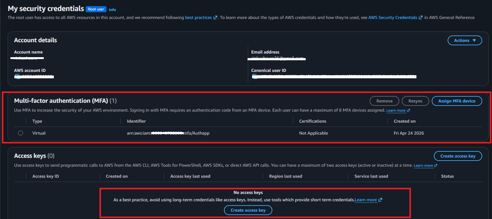

### 2. IAM Security Dashboard

Reviewed the IAM security recommendations and verified the account security status.

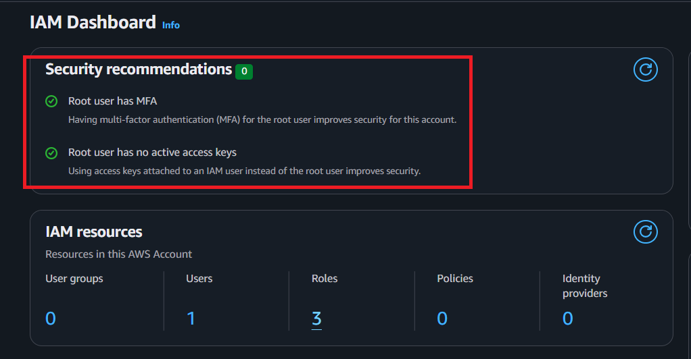

### 3. AWS Monthly Budget

Created a monthly AWS budget of `$5` to monitor account spending and help prevent unexpected costs.

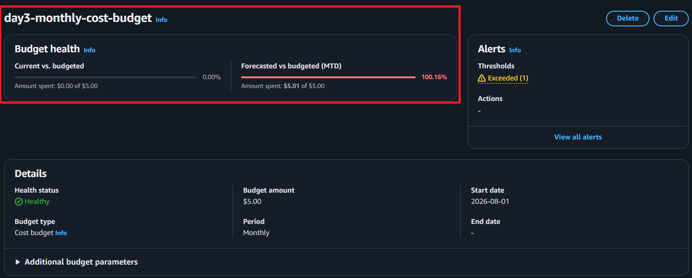

### 4. Budget Alerts

Configured budget alerts for actual and forecasted spending thresholds.

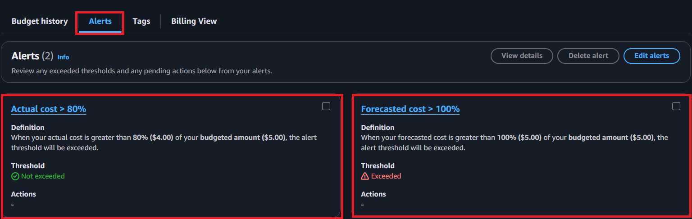

### 5. CloudTrail Console Login Event

Reviewed a `ConsoleLogin` event in AWS CloudTrail to verify account activity monitoring.

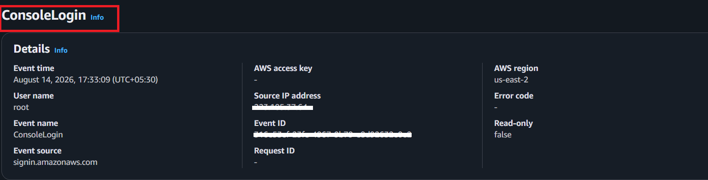

### 6. IAM Access Analyzer

Configured IAM Access Analyzer and verified that there were no findings.

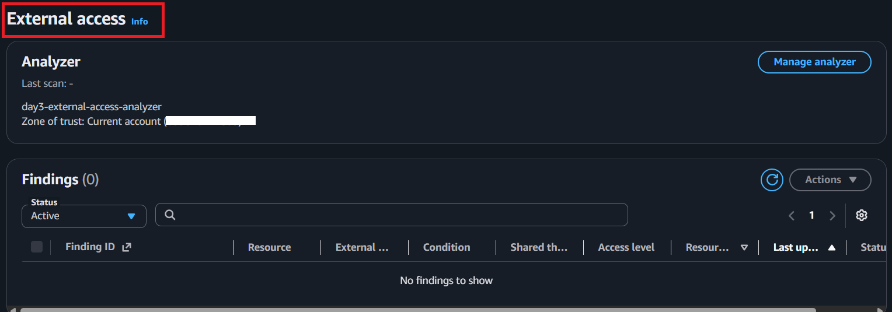

### 7. CloudWatch Billing Alerts

Enabled CloudWatch billing alerts to receive notifications when billing metrics are available.

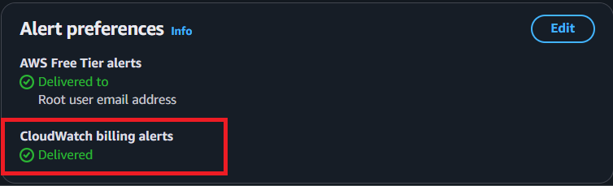

### 8. CloudWatch Billing Alarm & SNS

Created a CloudWatch billing alarm using the `EstimatedCharges` metric and configured Amazon SNS email notifications.

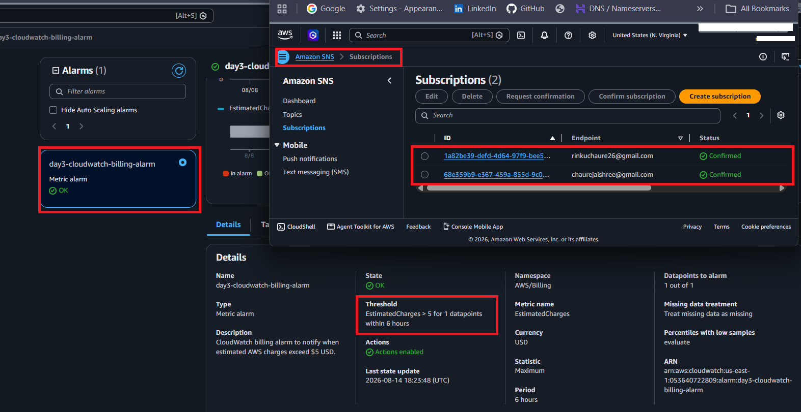

### Result

- Root User MFA: `Enabled`
- Root User Access Keys: `None`
- IAM Security Recommendations: `Reviewed`

> **Best Practice:** Protect the root user with MFA and avoid using it for daily AWS operations.

> **Least privilege means giving only the permissions required to perform a task — nothing extra.**

I also learned how `IAM, CloudTrail, IAM Access Analyzer, CloudWatch, Amazon SNS, and AWS Budgets` work together to improve the security, monitoring, and cost visibility of an AWS environment.

---

## Lab 2 - S3 Read-Only Access

### Objective

Practice least-privilege access by giving an IAM user read-only access to Amazon S3.

### Create Group:

```text
Group: S3ReadOnlyGroup
Policy: AmazonS3ReadOnlyAccess
```
### Create user:

```text
User name: learner-s3
Add user to: S3ReadOnlyGroup
```

### Test:

1. Created the `S3ReadOnlyGroup` IAM group.
2. Attached the AWS managed policy `AmazonS3ReadOnlyAccess`.
3. Created the IAM user `learner-s3`.
4. Added `learner-s3` to `S3ReadOnlyGroup`.
5. Verified that `learner-s3` can view S3 resources but cannot delete objects.

### Deliverables:

### 1. Group created & Policy Attached

Created the `S3ReadOnlyGroup` and attached the AWS managed `AmazonS3ReadOnlyAccess` policy.

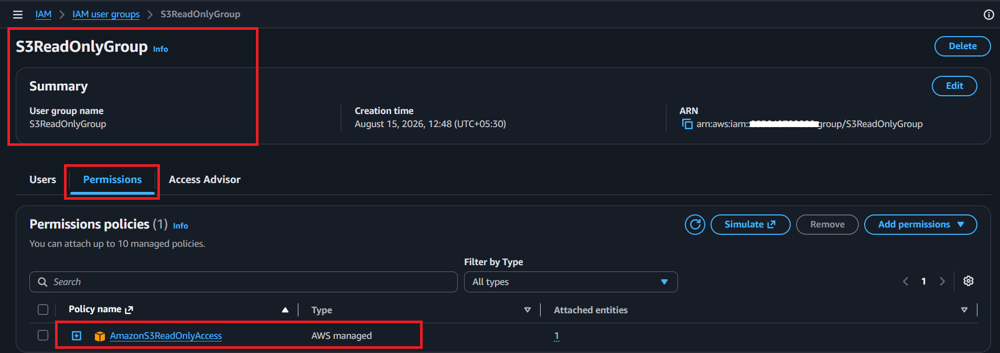

### 2. User Added to group

Added `learner-s3` to `S3ReadOnlyGroup` to inherit the read-only S3 permissions.

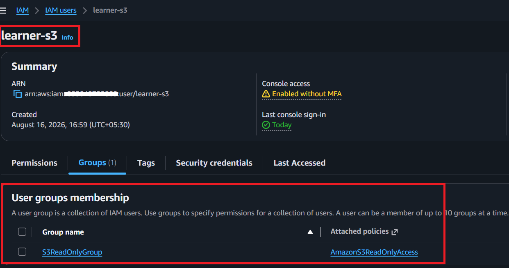

### 3. Allowed S3 view action

Signed in as `learner-s3` and verified that the user could view an S3 bucket and its objects.

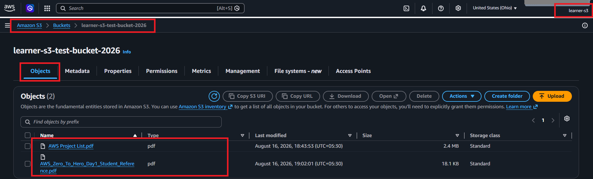

### 4. Denied Action

- Attempted to delete S3 objects as `learner-s3`.
- The operation failed with **Access Denied**, confirming that the user has read-only access and cannot delete objects.

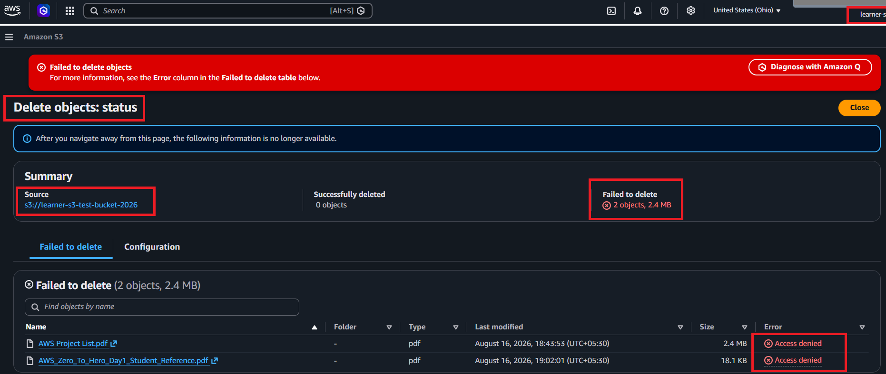

### Result

- [x] S3 bucket can be viewed
- [x] S3 objects can be viewed
- [x] Delete operation was denied
- [x] Read-only access verified

---

## Lab 3 - EC2 Read-Only Access

### Objective

Practice least-privilege access by giving an IAM user read-only access to Amazon EC2.

### Create group:

```text
Group name: EC2ReadOnlyGroup
Policy: AmazonEC2ReadOnlyAccess
```
### Create user:

```text
User name: learner-ec2
Add user to: EC2ReadOnlyGroup
```
### Test:

1. Created the `EC2ReadOnlyGroup` IAM group.
2. Attached the AWS managed policy `AmazonEC2ReadOnlyAccess`.
3. Created the IAM user `learner-ec2`.
4. Added `learner-ec2` to `EC2ReadOnlyGroup`.
5. Verified that learner-ec2 can view EC2 resources but cannot terminate instances.

### Deliverables:

### 1. EC2ReadOnlyGroup & Policy attached

Created the `EC2ReadOnlyGroup` and attached the AWS managed `AmazonEC2ReadOnlyAccess` policy.

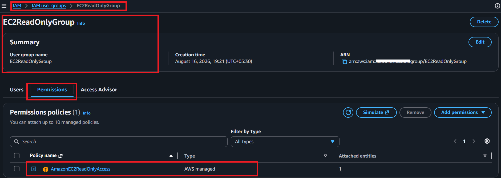

### 2. User Added to group

Added `learner-ec2` to `EC2ReadOnlyGroup` to inherit the read-only EC2 permissions.

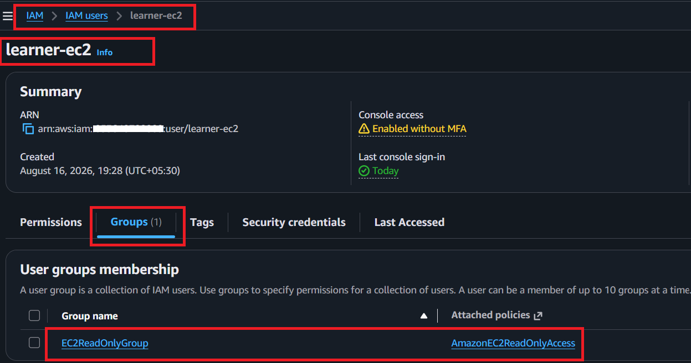

### 3. EC2 Dashboard access

Signed in as `learner-ec2` and successfully viewed the EC2 Instances page.

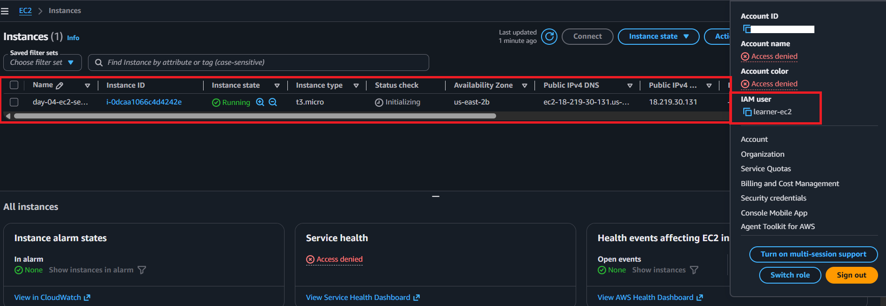

### 4. Denied Terminate action

- Attempted to terminate an EC2 instance as `learner-ec2`.
- The operation failed with **Access Denied**, confirming that the user can view EC2 resources but cannot modify or terminate them.

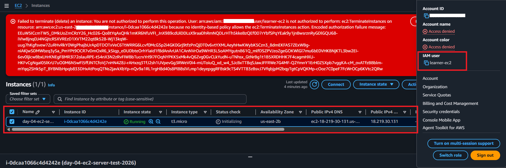

### Result

- [x] EC2 dashboard can be viewed
- [x] EC2 instances can be viewed
- [x] Instance termination was denied
- [x] Read-only access verified

---

## Lab 4 - Billing Read-Only Access

### Objective

Practice least-privilege access by giving an IAM user read-only access to AWS billing information.

### Create group:

```text
Group name: BillingViewGroup
Policy: AWSBillingReadOnlyAccess
```
### Create user:

```text
User name: learner-billing
Add user to: BillingViewGroup
```
### Test:

1. Created the `BillingViewGroup` IAM group.
2. Attached the AWS managed policy `AWSBillingReadOnlyAccess`.
3. Created the IAM user `learner-billing`.
4. Added `learner-billing` to `BillingViewGroup`.
5. Enabled IAM user and role access to Billing information from the root account.
6. Confirmed that the user cannot access unrelated AWS services.

### Deliverables:

### 1. BillingViewGroup & Policy attached

Created the `BillingViewGroup` and attached the AWS managed `AWSBillingReadOnlyAccess` policy.

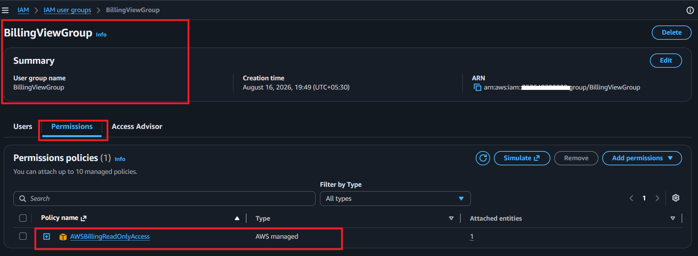

### 2.User Added to group

Added `learner-billing` to `BillingViewGroup` to inherit the read-only billing permissions.

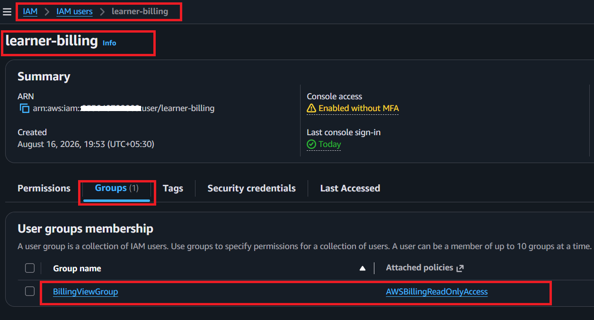

### 3. IAM User and Role Billing Access Enabled

Enabled IAM access to Billing so users with `AWSBillingReadOnlyAccess` can view billing information without using the root user.

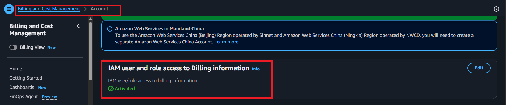

### 4. Billing Dashboard Access

Signed in as `learner-billing` and successfully viewed billing information with read-only access.

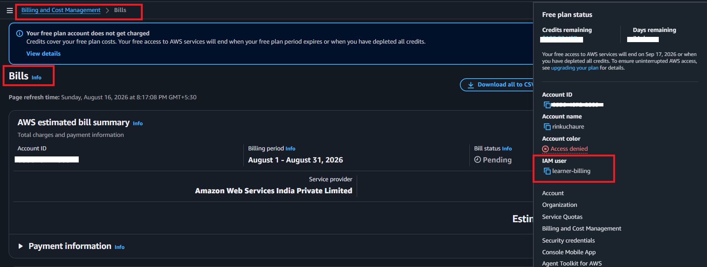

### 5. Unrelated Service Access Denied

- Attempted to access EC2 resources as `learner-billing`.
- The request failed with **Access Denied** because `learner-billing` does not have permission to perform `ec2:DescribeInstances`.

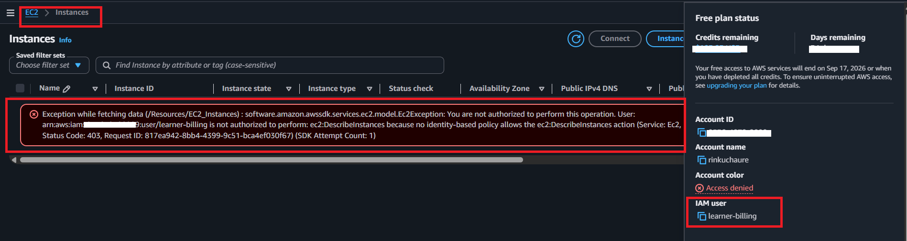

### Result

- [x] Billing Dashboard can be viewed
- [x] Billing information can be accessed
- [x] Unrelated EC2 access was denied
- [x] Billing read-only access verified

---

## Lab 5 - Custom S3 Read-Only Policy

### Objective

Create a customer-managed IAM policy that provides **read-only access** to a specific S3 bucket.

### Create Custom Policy

Create a customer-managed policy named:

```text
CustomS3ReadOnlyTrainingPolicy
```

Use this structure and replace `YOUR-BUCKET-NAME`:

```json
{
  "Version": "2012-10-17",
  "Statement": [
    {
      "Effect": "Allow",
      "Action": [
        "s3:ListAllMyBuckets"
      ],
      "Resource": "*"
    },
    {
      "Effect": "Allow",
      "Action": [
        "s3:ListBucket"
      ],
      "Resource": "arn:aws:s3:::YOUR-BUCKET-NAME"
    },
    {
      "Effect": "Allow",
      "Action": [
        "s3:GetObject"
      ],
      "Resource": "arn:aws:s3:::YOUR-BUCKET-NAME/*"
    }
  ]
}
```

### Deliverables:

**Custom S3 Policy:**  [CustomS3ReadOnlyTrainingPolicy.json](./policies/CustomS3ReadOnlyTrainingPolicy.json)

### 1. Custom Policy Created

Created the customer-managed `CustomS3ReadOnlyTrainingPolicy` with read-only permissions for the training S3 bucket.

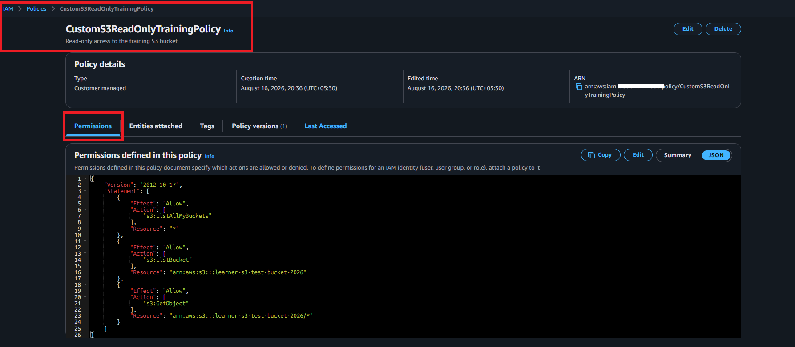

### 2. Policy Attached to `learner-custom-s3`

Attached the custom policy to `learner-custom-s3` through the `CustomS3ReadOnlyGroup`.

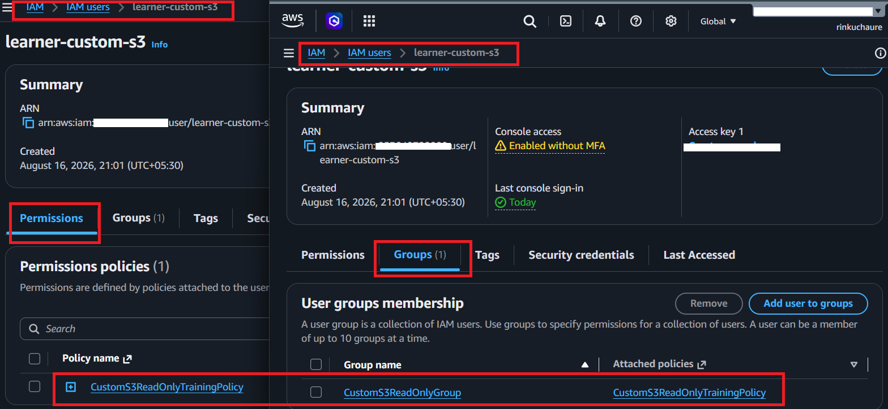

### 3. Allowed Actions

Successfully listed the S3 bucket, viewed its objects, and downloaded an object using the `learner-custom-s3` profile.

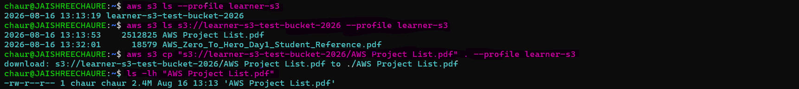

### 4. Denied Actions

Attempted to upload and delete an object. Both actions were denied because the policy only allows read-only S3 permissions.

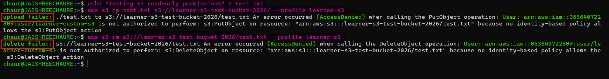

### Result

- [x] Customer-managed S3 read-only policy created
- [x] Policy attached to learner-custom-s3
- [x] S3 listing and object download allowed
- [x] Upload operation was denied
- [x] Delete operation was denied
- [x] Custom read-only access verified

---

## Lab 6 - Optional Advanced Lab — Switch Role

### Objective

Understand **IAM role assumption**, **temporary credentials**, and **role-based access** using AWS STS.

### 1. Create IAM Role

Create an IAM role with the following configuration:

```text
Role name: S3ReadOnlyRole
Policy: AmazonS3ReadOnlyAccess
```
The role provides read-only access to Amazon S3.

### 2. Configure Trust Relationship

Allow the IAM user `learner-custom-s3` to assume the role.

Trust policy:

```json
{
  "Version": "2012-10-17",
  "Statement": [
    {
      "Effect": "Allow",
      "Principal": {
        "AWS": "arn:aws:iam::ACCOUNT-ID:user/learner-custom-s3"
      },
      "Action": "sts:AssumeRole"
    }
  ]
}
```
Replace `ACCOUNT-ID` with your AWS account ID.

### 3. Allow the IAM User to Assume the Role

Attach an inline policy to the IAM user:

```json
{
  "Version": "2012-10-17",
  "Statement": [
    {
      "Effect": "Allow",
      "Action": "sts:AssumeRole",
      "Resource": "arn:aws:iam::ACCOUNT-ID:role/S3ReadOnlyRole"
    }
  ]
}
```
Replace `ACCOUNT-ID` with your AWS account ID.

### 4. Verify Role Permissions

The role should have: `AmazonS3ReadOnlyAccess`

This allows read-only S3 operations such as:

- List S3 buckets
- List objects
- Download objects
- Read object metadata

It should not allow:

- Uploading objects
- Deleting objects
- Modifying bucket contents

### 5. Test Role Assumption Using AWS CLI

Use the IAM user profile to assume the role:

```bash
aws sts assume-role \
  --role-arn arn:aws:iam::ACCOUNT-ID:role/S3ReadOnlyRole \
  --role-session-name s3-readonly-test \
  --profile learner-s3
```
The command should return temporary credentials: `AccessKeyId`, `SecretAccessKey`, `SessionToken` and `Expiration`

### 6. Configure the Assumed Role Profile

Add the temporary credentials to: `~/.aws/credentials`.

Example:

```INI
[learner-s3-role]
aws_access_key_id = TEMPORARY_ACCESS_KEY
aws_secret_access_key = TEMPORARY_SECRET_KEY
aws_session_token = TEMPORARY_SESSION_TOKEN
```

### 7. Verify the Assumed Identity

```bash
aws sts get-caller-identity --profile learner-s3-role
```
### 8. Test Allowed S3 Access

1. List the S3 buckets: `aws s3 ls --profile learner-s3-role`
2. List objects inside the training bucket: `aws s3 ls s3://learner-s3-test-bucket-2026 --profile learner-s3-role`
3. Download an object: `aws s3 cp "s3://learner-s3-test-bucket-2026/AWS Project List.pdf" . --profile learner-s3-role`

### 9. Test Denied Access

1. Create a test file: `echo "Testing assumed role" > role-test.txt`
2. Try uploading it: `aws s3 cp role-test.txt s3://learner-s3-test-bucket-2026/ --profile learner-s3-role`

This confirms that the assumed role has read-only access and does not have s3:PutObject permission.

### Deliverables:

### 1. Role Created

Created the `S3ReadOnlyRole` with the `AmazonS3ReadOnlyAccess` policy.

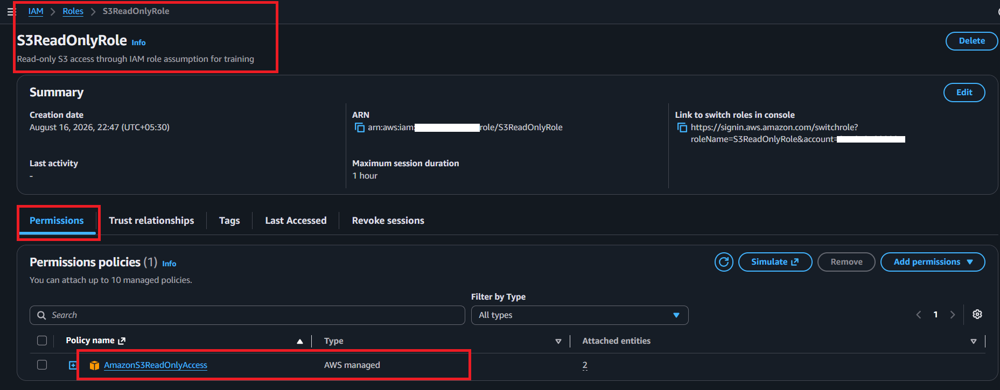

### 2. Trust Relationship

Configured the trust relationship to allow `learner-custom-s3` to assume the role.

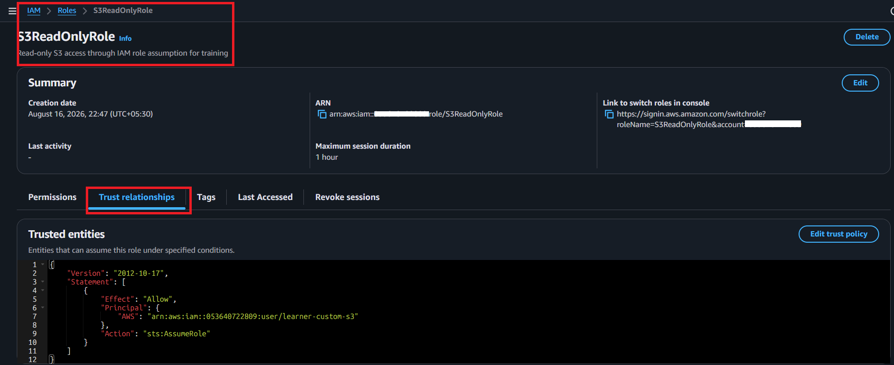

### 3. Role Permissions

Verified that `AmazonS3ReadOnlyAccess` is attached to the role.

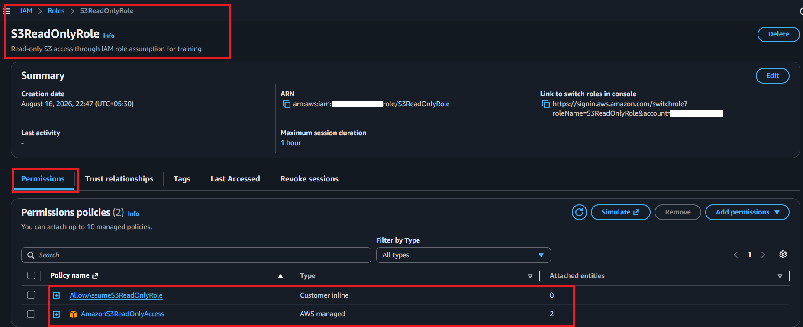

### 4. Role Assumption Success

Successfully assumed the `S3ReadOnlyRole` and received temporary credentials through AWS STS.

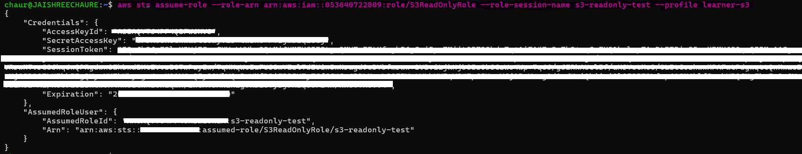

### 5. S3 Access Test

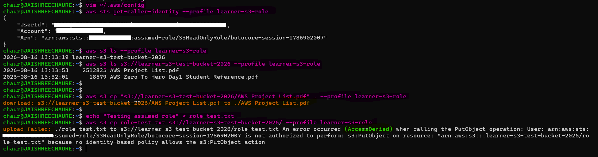

Successfully performed allowed S3 read operations and verified that the upload attempt was denied.

### Result

- [x] S3ReadOnlyRole created
- [x] Trust relationship configured
- [x] learner-custom-s3 allowed to assume the role
- [x] Temporary credentials generated through AWS STS
- [x] S3 read access verified
- [x] S3 upload access denied
- [x] Temporary role-based read-only access verified

---

## Lab 7 - Optional GitHub OIDC Challenge

This is optional. Try it only after completing the IAM user and group labs.

In this lab, GitHub Actions accesses AWS without storing long-lived AWS access keys.

Instead, GitHub Actions uses OIDC to obtain temporary AWS credentials by assuming an IAM role.

> **Important:** This repository was created in August 2026. GitHub repositories created after **July 15, 2026** use immutable subject claims by default.

Because this repository was created after this date, the GitHub OIDC trust policy must use the immutable subject claim format containing the GitHub owner ID and repository ID.

## Architecture

`GitHub Actions -> OIDC Token -> AWS IAM OIDC Provider -> IAM Role -> AWS STS -> Temporary Credentials -> S3`

## Step 1 - Create GitHub Repository

Before configuring AWS OIDC, create a GitHub repository for the hands-on workflow.

Create a new repository:

```text
Repository name: github-actions-oidc-demo
Owner: Jaishree97
Visibility: Public
Default branch: main
```
**Repository:**  https://github.com/Jaishree97/github-actions-oidc-demo/tree/main

The repository is used to store the GitHub Actions workflow that will authenticate to AWS using OIDC.

> **Important:** The repository was created in August 2026, which is after the July 15, 2026 GitHub immutable subject claims change.

Therefore, this lab uses the immutable OIDC subject claim format instead of relying only on the traditional repository-based subject.

---

## Step 2 - Add GitHub OIDC Provider

Open:

`AWS Console -> IAM -> Identity Providers -> Add Provider`

Use:

- Provider type: `OpenID Connect`
- Provider URL: `https://token.actions.githubusercontent.com`
- Audience: `sts.amazonaws.com`

The OIDC provider allows AWS IAM to trust identity tokens issued by GitHub Actions.

---

## Step 3 - Create IAM Role

Create a role with:

- Trusted entity: `Web Identity`
- Provider: `token.actions.githubusercontent.com`
- Audience: `sts.amazonaws.com`
- Permission: `AmazonS3ReadOnlyAccess`

Example role name: `github-oidc-challenge-role`

**Role Description:** 

**IAM role for GitHub Actions OIDC authentication with Amazon S3 read-only access.**

---

## Step 4 - Configure OIDC Trust Policy

The trust policy restricts which GitHub repository and branch can assume the IAM role.

GitHub uses an OIDC sub claim to identify the workflow requesting AWS access.

For repositories using immutable subject claims, the subject contains the GitHub owner ID and repository ID.

Since this repository was created after July 15, 2026, the immutable subject claim format is used.

Replace placeholders before using:

```json
{
  "Version": "2012-10-17",
  "Statement": [
    {
      "Effect": "Allow",
      "Principal": {
        "Federated": "arn:aws:iam::<AWS_ACCOUNT_ID>:oidc-provider/token.actions.githubusercontent.com"
      },
      "Action": "sts:AssumeRoleWithWebIdentity",
      "Condition": {
        "StringEquals": {
          "token.actions.githubusercontent.com:aud": "sts.amazonaws.com"
        },
        "StringLike": {
          "token.actions.githubusercontent.com:aud": "sts.amazonaws.com",
            "token.actions.githubusercontent.com:sub": "repo:<GITHUB_USER>@<OWNER_ID>/<REPOSITORY>@<REPOSITORY_ID>:ref:refs/heads/main"
          ]
        }
      }
    }
  ]
}
```
Example

```text
Owner ID: <OWNER_ID>
Repository ID: <REPOSITORY_ID>
Repository: Jaishree97/github-actions-oidc-demo
Branch: main
```
The immutable subject follows this structure: `repo:<OWNER>@<OWNER_ID>/<REPOSITORY>@<REPOSITORY_ID>:ref:refs/heads/main`

> **This provides stronger protection than relying only on repository names because the subject is tied to stable GitHub owner and repository IDs.**

--- 

## Step 5 - Create GitHub Actions Workflow

Create the workflow directory: `.github/workflows/`

Create: `.github/workflows/aws-oidc-challenge.yml`

Use:

```yaml
name: GitHub OIDC Immutable Subject Claims

on:
  workflow_dispatch:

permissions:
  id-token: write
  contents: read

jobs:
  oidc-immutable-demo:
    runs-on: ubuntu-latest

    steps:
      - name: Checkout repository
        uses: actions/checkout@v4

      - name: Configure AWS Credentials using OIDC
        uses: aws-actions/configure-aws-credentials@v4
        with:
          role-to-assume: ${{ secrets.AWS_ROLE_ARN }}
          role-session-name: GitHubActions
          aws-region: ${{ vars.AWS_REGION }}

      - name: Verify AWS Identity
        run: aws sts get-caller-identity

      - name: Validate S3 Read Access
        run: aws s3 ls
```
The workflow requests an OIDC token from GitHub and uses it to obtain temporary AWS credentials through AWS STS.

---

## Step 6 - Configure GitHub Repository Secret

Open:

`GitHub Repository -> Settings -> Secrets and variables -> Actions`

Create a repository secret: `Name: AWS_ROLE_ARN`

Value: `arn:aws:iam::<AWS_ACCOUNT_ID>:role/github-oidc-challenge-role`

The IAM role ARN is stored as a GitHub repository secret instead of hardcoding it in the workflow.

---

## Step 7 - Configure GitHub Repository Variable

Create a repository variable: `Name: AWS_REGION`, `Value: ap-south-1`

The workflow reads the AWS region using: `aws-region: ${{ vars.AWS_REGION }}`

---

## Step 8 - Run GitHub Actions Workflow

Open: `GitHub Repository -> Actions`

Select: `GitHub OIDC Immutable Subject Claims`

Click: `Run workflow`

Select the `main` branch and run the workflow.

The workflow performs:

1. Checkout repository
2. Configure AWS credentials using OIDC
3. Verify AWS identity
4. Validate S3 read access

---

## Where I Got Stuck

### Troubleshooting Screenshots

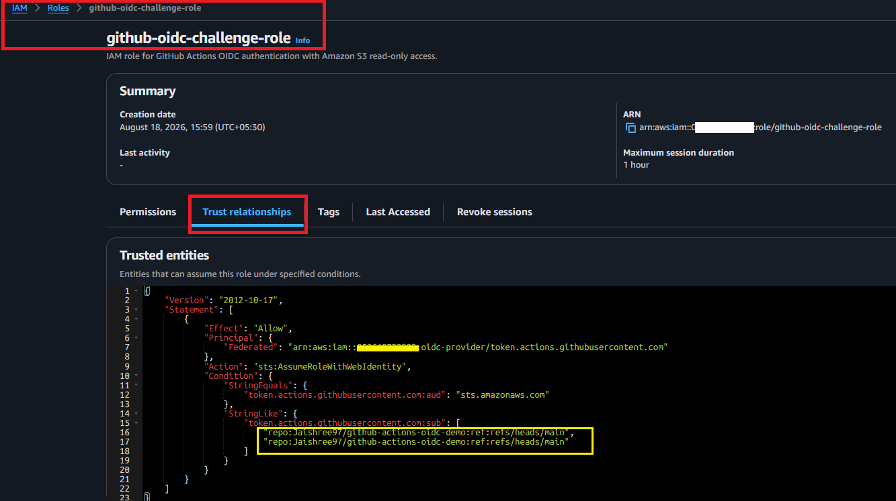

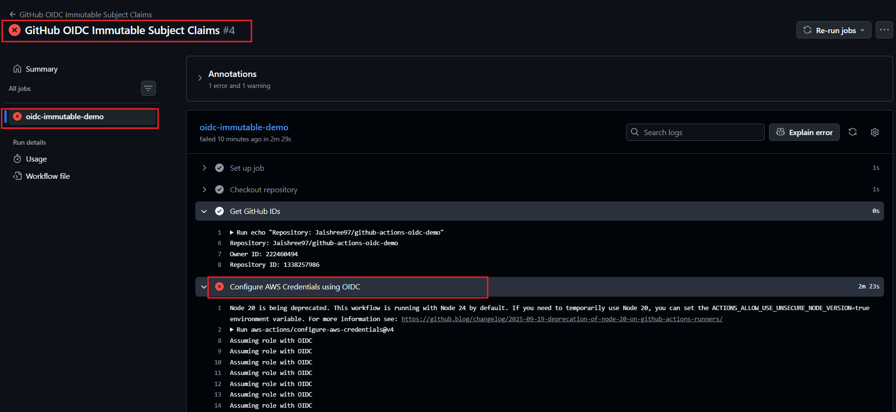

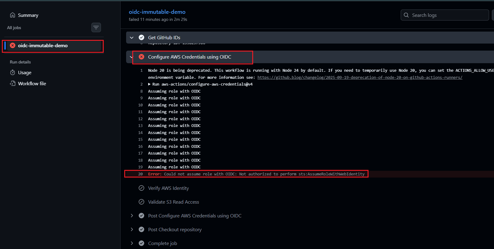

The GitHub Actions workflow was configured correctly, but the IAM trust policy was using the older GitHub OIDC sub format.

The initial trust policy used: `repo:Jaishree97/github-actions-oidc-demo:ref:refs/heads/main`

Because this repository was created after July 15, 2026, GitHub uses immutable subject claims.

The required format is: `repo:<OWNER>@<OWNER_ID>/<REPOSITORY>@<REPOSITORY_ID>:ref:refs/heads/main`

### Repository IDs

```text
Repository: Jaishree97/github-actions-oidc-demo
Owner ID: 222460494
Repository ID: 1338257986
Branch: main
```
The immutable subject became: `repo:Jaishree97@222460494/github-actions-oidc-demo@1338257986:ref:refs/heads/main`

### Resolution

I updated the IAM trust policy to use the immutable GitHub OIDC subject.

After updating the trust policy, the GitHub Actions workflow successfully assumed the AWS IAM role.

---

### Deliverables:

### 1. GitHub Repository Created

Created the GitHub repository used for the OIDC hands-on workflow.

Repository: https://github.com/Jaishree97/github-actions-oidc-demo/tree/main

### 2. GitHub OIDC Identity Provider

Created the AWS IAM OIDC provider for GitHub Actions.

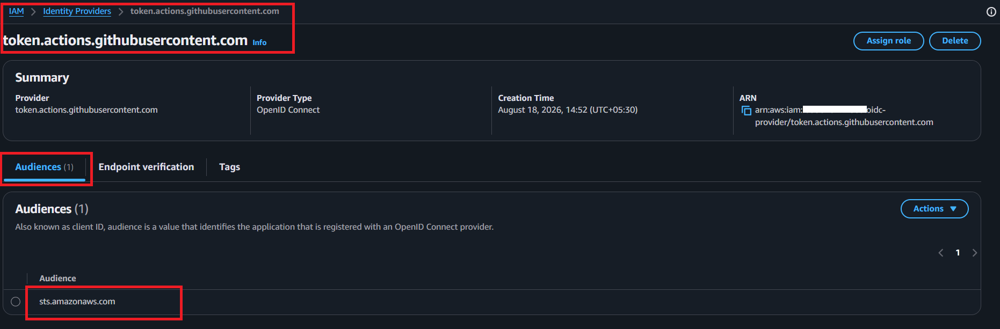

### 3. IAM Role Created

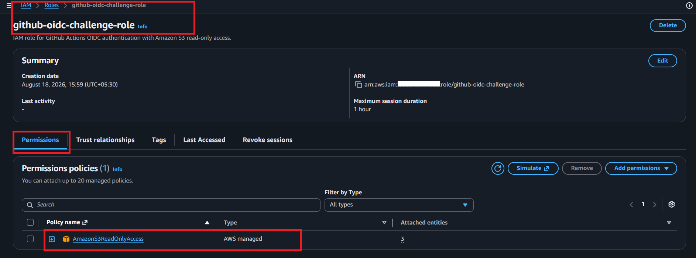

### 4. Immutable Trust Policy

Configured the IAM trust policy using the GitHub owner ID and repository ID.

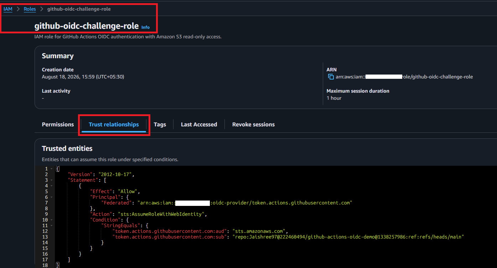

### 5. GitHub Actions Workflow

Created the GitHub Actions workflow with OIDC authentication.

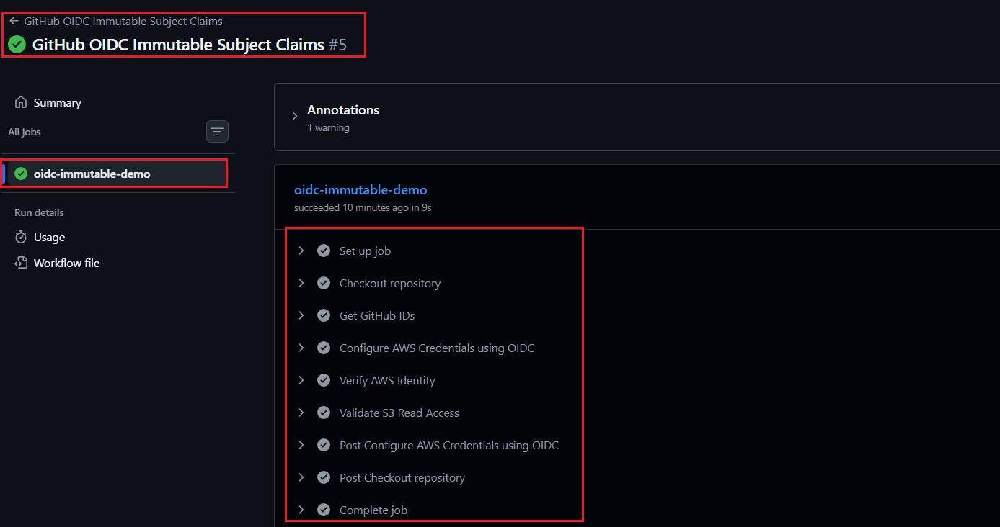

### 6. STS Assumed Role Output

Successfully configured AWS credentials using GitHub OIDC.

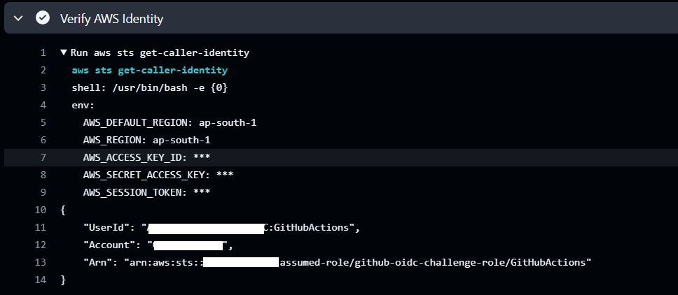

### 7. Validate S3 Read Access

Successfully validated S3 read access using the temporary AWS credentials.

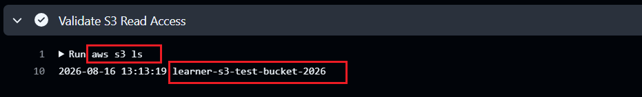

---

## Workflow 

[Workflow](./oidc/aws-oidc-challenge.yml)

## Key Takeaway

- Least privilege should be applied to every IAM identity.
- IAM groups simplify permission management.
- IAM roles provide temporary access without long-lived credentials.
- OIDC allows GitHub Actions to access AWS without storing AWS access keys.
- Restrict OIDC trust policies to specific repositories and branches.
- Always clean up unused AWS resources to avoid unexpected costs.

---

## Cleanup

Removed the test IAM users, groups, policies, and roles created for the labs.

> Cleanup helps avoid unnecessary AWS charges and keeps the AWS account secure.

## LinkedIn Post

https://www.linkedin.com/posts/jaishree-chaure_10weeksofaws-10weeksofaws-aws10weekchallenge-ugcPost-7495550648747237376-0g86/?utm_source=social_share_send&utm_medium=member_desktop_web&rcm=ACoAAF_I4BMBPEwF60DBltPTvhk0Dn7RaD74htE