# Week 2 - Day 3: IAM Roles and STS

## Name

Jaishree Chaure

## Objective

Build and validate a secure EC2-to-S3 access pattern using an IAM Role instead of manually configured AWS access keys.

---

## Tasks Completed

- [x] Reviewed the weekly AWS security content
- [x] Created S3 test buckets
- [x] Created and configured EC2 IAM Role
- [x] Configured trust and least-privilege policies
- [x] Launched EC2 and attached IAM Role
- [x] Connected to EC2 using SSH from WSL
- [x] Verified IAM Role using STS
- [x] Verified credentials were provided through IAM Role/IMDS
- [x] Tested S3 read access
- [x] Tested denied access to another bucket
- [x] Tested denied S3 write access
- [x] Tested denied S3 delete access
- [x] Performed IAM troubleshooting
- [x] Captured screenshots/proof
- [x] Cleaned up AWS resources
- [x] Posted on LinkedIn

---

## Topics Practiced

- Trust policy vs permission policy
- STS AssumeRole
- EC2 IAM Role and Instance Profile
- Temporary credentials through IMDS
- EC2-to-S3 role-based access
- Least-privilege S3 access
- Resource-level S3 permissions
- IAM authorization testing
- IAM troubleshooting

---

## What I Built

I built and validated a secure **EC2-to-S3 integration using IAM Roles and STS temporary credentials**, avoiding long-term AWS access keys.

I created **Week2Day3EC2S3ReadRole** with an EC2 trust policy and a **least-privilege S3 policy** allowing only `s3:ListBucket` and `s3:GetObject` on **`ec2-s3-read-lab-jaishree-chaure-2026`**. I attached the role to the EC2 instance **`ec2-s3-read-lab-jaishree-chaure-2026`** through an instance profile.

I created a test object **`day3-test.txt`** and verified that EC2 could list the bucket and read the object using the assumed IAM role. I also tested the security boundaries by verifying that access to a separate S3 bucket, object uploads, and object deletion returned **`AccessDenied`**.

Finally, I intentionally introduced an IAM permission misconfiguration, diagnosed the `AccessDenied` error, restored the correct policy, and verified access again.

This lab strengthened my understanding of **IAM Roles, trust policies, instance profiles, STS, IMDS, least privilege, resource-level permissions, and IAM troubleshooting**.

---

## Allowed Test

I verified that the Amazon EC2 instance **`ec2-s3-read-lab-jaishree-chaure-2026`** could securely access the Amazon S3 bucket **`ec2-s3-read-lab-jaishree-chaure-2026`** using the attached IAM role **`Week2Day3EC2S3ReadRole`**.

The EC2 instance successfully listed the bucket contents and read the test object **`day3-test.txt`** using **temporary credentials provided through the IAM role**, without manually configuring AWS access keys. This confirmed that the `s3:ListBucket` and `s3:GetObject` permissions were working as intended.

---

## Denied Test

I validated the IAM role's **least-privilege boundaries** by testing operations that were intentionally not granted.

The EC2 instance received **`AccessDenied`** when attempting to access the separate S3 bucket **`ec2-s3-denied-lab-jaishree-chaure-2026`**, upload an object to the allowed bucket, and delete **`day3-test.txt`**.

These failures were expected because the IAM policy grants only **`s3:ListBucket`** and **`s3:GetObject`** for the specific allowed bucket. It does not grant **`s3:PutObject`**, **`s3:DeleteObject`**, or access to other S3 buckets.

This confirmed that the IAM role enforced **least-privilege and resource-level access control** as intended.

---

### Deliverables

### 1. Trust Policy

The trust policy allows the Amazon EC2 service (`ec2.amazonaws.com`) to assume the IAM role **`Week2Day3EC2S3ReadRole`**.

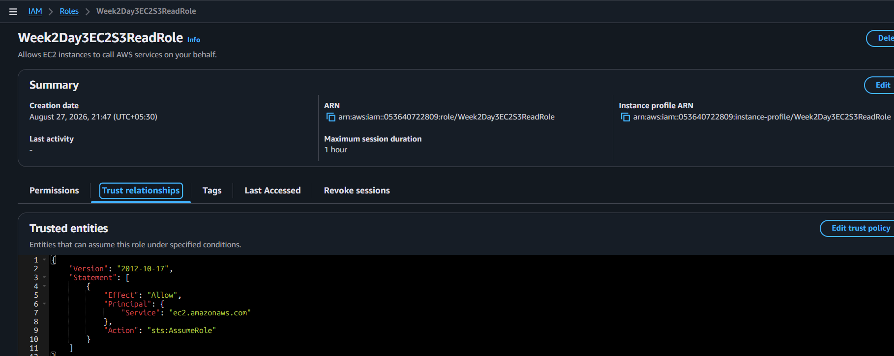

### 2. Inline IAM Permission Policy

The inline IAM permission policy **`ReadOneTrainingBucket`** grants only the required read permissions (`s3:ListBucket` and `s3:GetObject`) on the S3 bucket **`ec2-s3-read-lab-jaishree-chaure-2026`**.

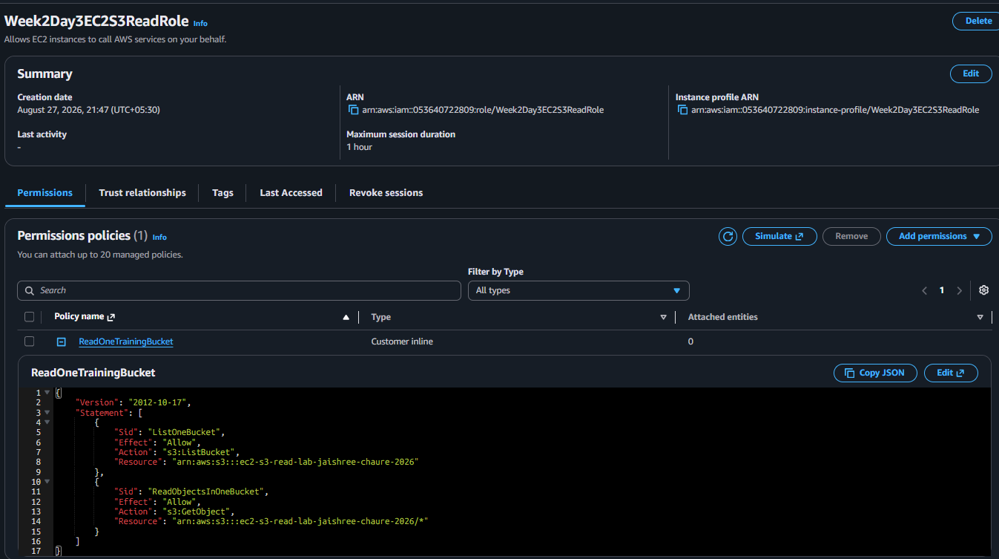

### 3. EC2 Instance with IAM Role

The IAM role **`Week2Day3EC2S3ReadRole`** was attached to the EC2 instance **`ec2-s3-read-lab-jaishree-chaure-2026`** through an instance profile.

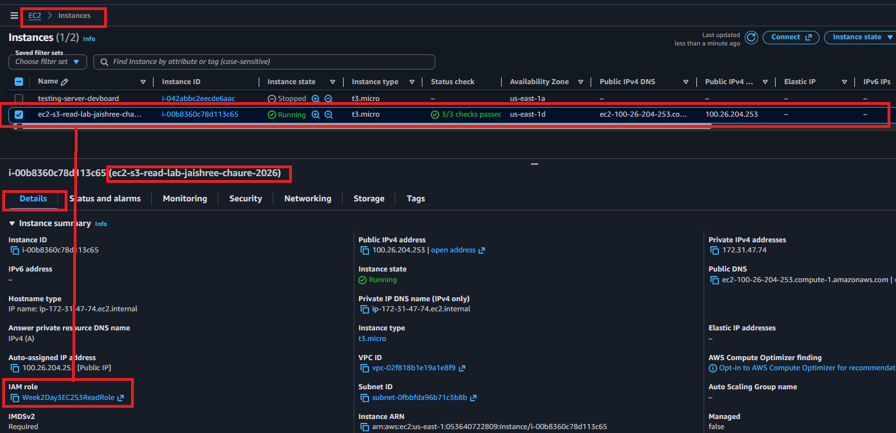

### 4. IAM Role Identity Verification

Verified with AWS STS that the EC2 instance was using the assumed IAM role.

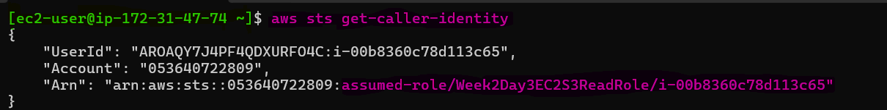

### 5. Temporary Credentials Verification

Verified that the AWS CLI was obtaining temporary credentials through the EC2 IAM role and IMDS instead of manually configured access keys.

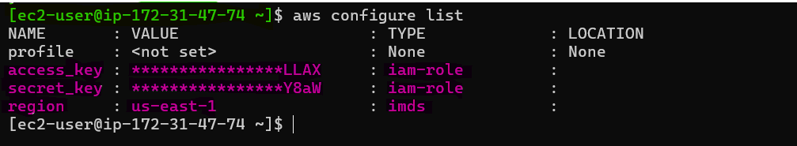

### 6. Successful S3 Read Access

Verified that the EC2 instance could list the allowed S3 bucket and read the test object **`day3-test.txt`**.

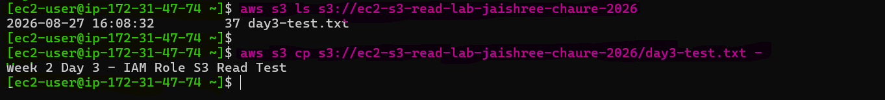

### 7. S3 Write Access Denied

Verified that attempting to upload an object returned **`AccessDenied`** because `s3:PutObject` was not granted.

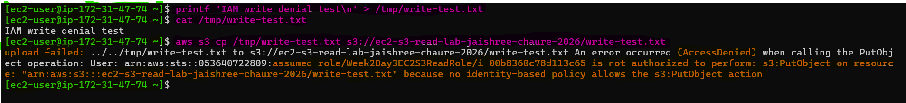

### 8. Access to Other S3 Bucket Denied

Verified that the IAM role could not list the separate S3 bucket **`ec2-s3-denied-lab-jaishree-chaure-2026`**.

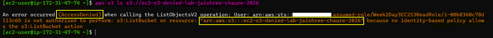

### 9. S3 Delete Access Denied

Verified that attempting to delete **`day3-test.txt`** returned **`AccessDenied`** because `s3:DeleteObject` was not granted.

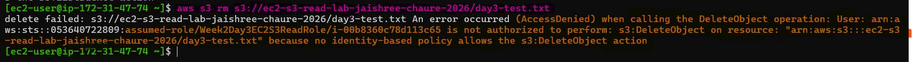

---

## Additional Validation & Troubleshooting

### 10. S3 Write Denial

Tested uploading an object to the allowed S3 bucket. The request returned **`AccessDenied`** because the IAM role does not grant `s3:PutObject`.

```bash
aws s3 cp /tmp/write-test.txt s3://ec2-s3-read-lab-jaishree-chaure-2026/write-test.txt
```

```text
s3:PutObject → DENIED ❌
```
This confirmed that the EC2 role provides read access without write permissions.

### 11. S3 Delete Denial

Tested deleting the existing `day3-test.txt` object. The request returned `AccessDenied` because `s3:DeleteObject` was not granted.

```bash
aws s3 rm s3://ec2-s3-read-lab-jaishree-chaure-2026/day3-test.txt
```

```text
s3:DeleteObject → DENIED ❌
```
This confirmed that the EC2 role could read the object but could not delete it.

### 12. IAM Troubleshooting Exercise

Intentionally changed the S3 permission from `s3:GetObject` to `s3:GetObjectVersion` and tested the object read again.

```text
s3:GetObject → s3:GetObjectVersion
```
The request returned `AccessDenied` because the requested `s3:GetObject` action was no longer allowed.

Verified the active IAM identity using:

```bash
aws sts get-caller-identity
```
After identifying the incorrect permission, restored `s3:GetObject` and successfully read `day3-test.txt` again.

```text
IAM policy restored → READ access working ✅
```

## What I Learned

This lab helped me understand how **IAM Roles and STS temporary credentials** provide secure EC2 access to AWS services without using long-term access keys.

I learned that:

- A **`trust policy** defines **who can assume an IAM role**, while a **permission policy** defines **what the role can do**.
- An **EC2 instance profile** connects the IAM role to EC2 and enables the AWS CLI to obtain temporary credentials through **IMDS**.
- **AWS STS** provides temporary credentials when EC2 assumes the attached IAM role.
- **Least privilege** limits access to only the required resources and actions. In this lab, EC2 could read `day3-test.txt` but could not upload, delete, or access another S3 bucket.
- `aws sts get-caller-identity` and `aws configure list` helped verify the active IAM role and credential source.
- Testing both **allowed and denied actions** is important to validate IAM security boundaries.

### Key Concepts

- **Trust Policy** → Defines **who can assume an IAM role**.
- **Permission Policy** → Defines **what actions the role can perform**.
- **IAM Role** → Provides a secure identity for AWS workloads.
- **AWS STS** → Provides **temporary security credentials**.
- **Instance Profile** → Connects an IAM role to an EC2 instance.
- **Least Privilege** → Grants only the permissions required.

## Where I Got Stuck

- Intentionally introduced an IAM permission misconfiguration, received `AccessDenied`, identified the incorrect permission, restored `s3:GetObject`, and verified the read operation again.

---

## Cleanup

After completing the lab, I deleted all resources created during the exercise to avoid unnecessary AWS charges and maintain a clean AWS environment.

### 1. Amazon EC2

Terminated the Amazon EC2 instance **`ec2-s3-read-lab-jaishree-chaure-2026`** and verified that no unnecessary Amazon EBS volumes remained.

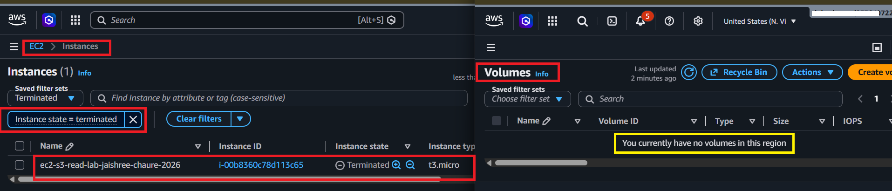

### 2. IAM Role

Deleted the IAM role **`Week2Day3EC2S3ReadRole`** after completing the validation and troubleshooting tests.

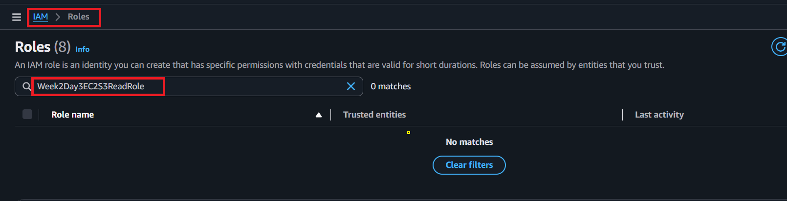

### 3. Amazon S3

Deleted the test S3 buckets and verified that no buckets remained from the lab.

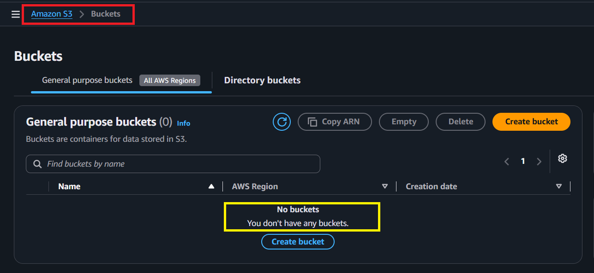

All resources created during the lab were successfully removed, ensuring no ongoing charges or unused resources remained in the AWS account.